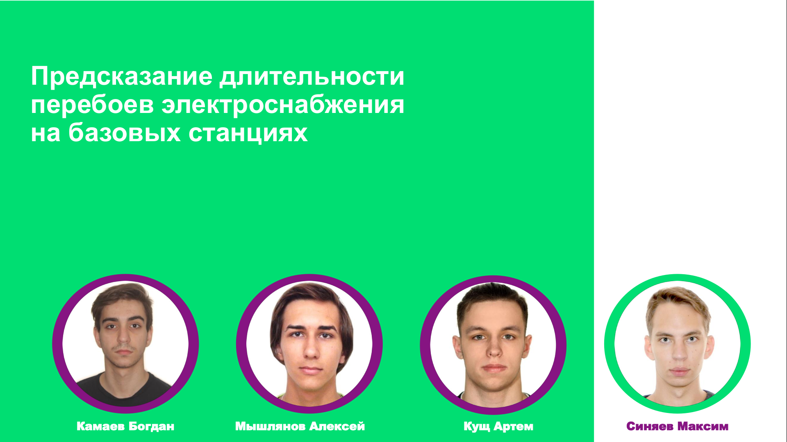
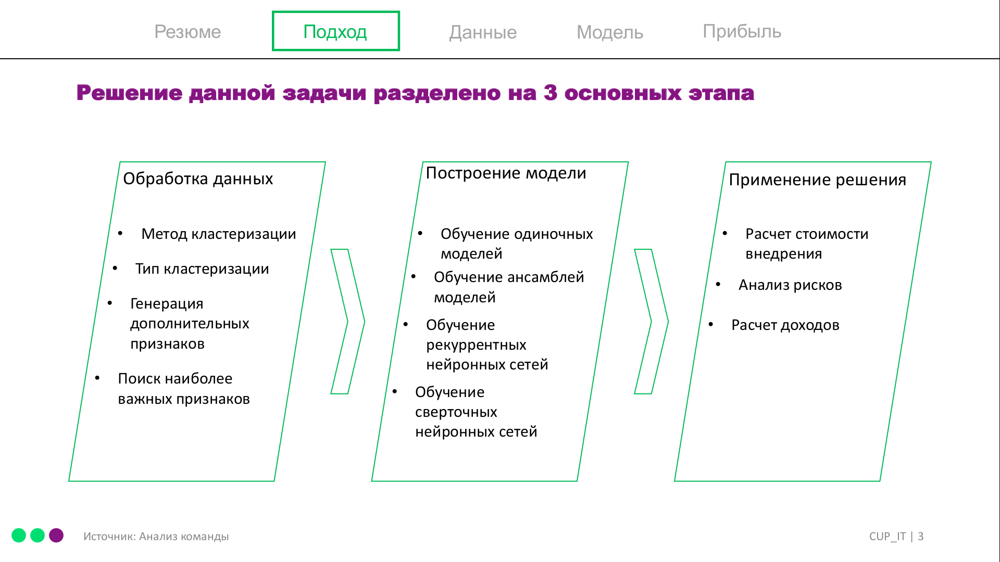
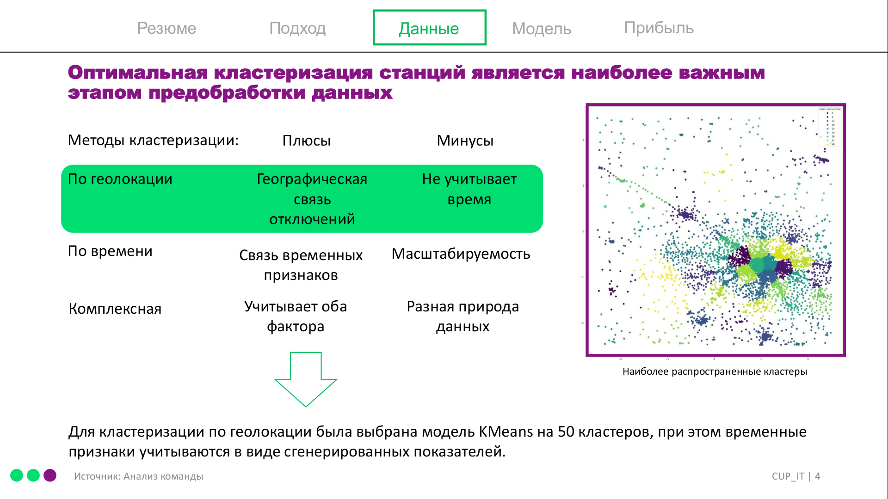
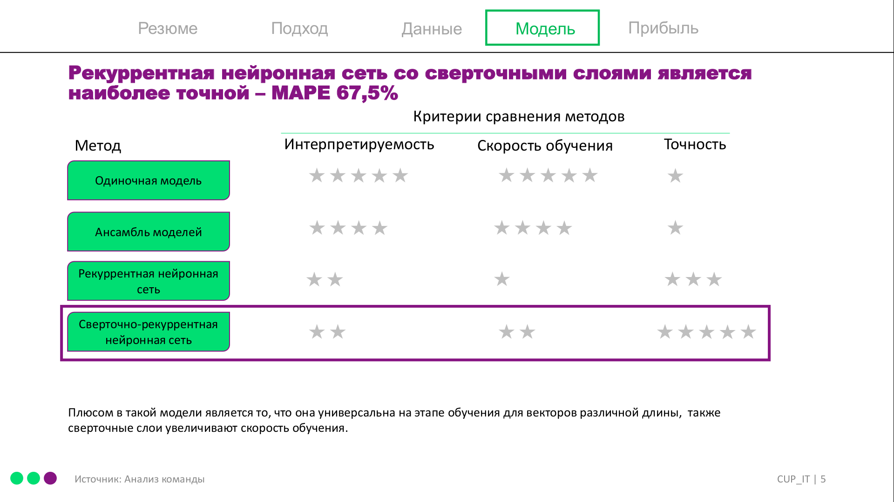
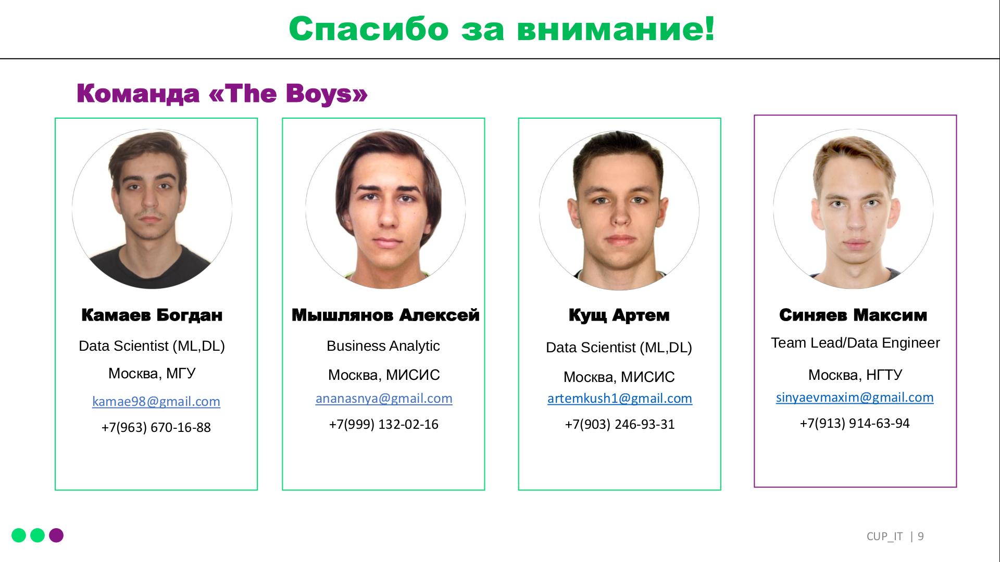

# CupIT2020 DataScience

   

Third place in final [CupIt](https://1.changellenge.com/cup-it) 2020 in section DataScience.
Team "The Boys", page with [results](https://1.changellenge.com/tech-it/online/results).

#### My role - Team Lead and Data Processing
Most of time I was working with data:
  - Data Processing
  - Features engineering
  - Data visualization
## Work Presentation

